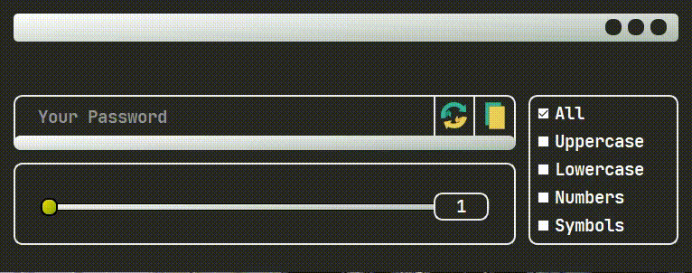

# Password_Generator
A Password Generator with GUI, using PyQt5, random and string module in Python, I hope you like it.

# Requires
```bash
  pip install PyQt5
```
```bash
  pip install pyperclip
```

# Usage/Examples
<kbd>
 
</kbd>


# Author
- Github: [@Aminjjjeffrey](https://github.com/Aminjjjeffrey)
- Twitter: [@Aminjjjeffrey](https://twitter.com/Aminjjjeffrey)


